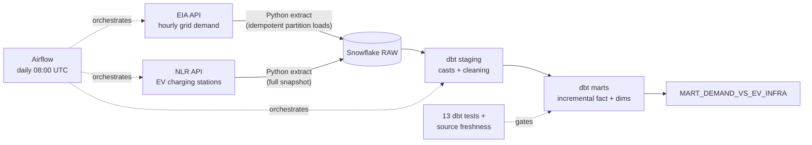

# EV Grid Pipeline

Production-style ELT pipeline correlating US electricity grid demand with EV charging infrastructure. Daily orchestrated loads from two public APIs into Snowflake, transformed and tested with dbt, scheduled by Airflow.

## Architecture



## Key engineering decisions

- **Idempotent loads.** Time-series facts use delete-then-insert by date partition inside a transaction — any day can be re-run or backfilled without duplicates. Dimension data uses full-snapshot replacement. Pattern chosen per source type.
- **Raw layer preserves source fidelity.** Values land as VARCHAR; casting happens in dbt staging via `try_cast`, where failures are visible and testable rather than silent at ingestion.
- **Incremental fact model** (`fct_daily_demand`) reprocesses only a trailing 3-day window on scheduled runs (late-arriving data buffer) using dbt's `delete+insert` strategy.
- **Quality gates.** 13 dbt tests (uniqueness, nulls, accepted values incl. DST-aware 23/24/25-hour days) plus source freshness checks that fail the pipeline if data goes stale >72h.
- **Backfill-safe orchestration.** The Airflow DAG passes the logical run date to extractors, so clearing any historical run replays exactly that day.

## Sample insight

California operates ~27 DC fast ports per GWh of daily grid demand — roughly 36x the density of the PJM region (0.74), showing how unevenly EV infrastructure is distributed relative to grid load.

## Stack

Python · Snowflake (key-pair auth) · dbt (dbt_utils) · Apache Airflow 3 · EIA Open Data API · NLR Alternative Fuel Stations API

## Repo layout

```
extract/       Python extractors (EIA incremental, NLR snapshot)
dbt_project/   dbt models: staging -> marts, tests, sources, seeds
airflow/dags/  daily DAG: parallel extracts -> freshness -> build -> test
sql/           Snowflake infrastructure setup
```

## Running it

1. `conda create -n evpipe python=3.11 && pip install -r requirements.txt`
2. Snowflake trial + key-pair auth (`sql/01_setup.sql`), EIA + NLR API keys -> `.env`
3. `python extract/eia_extract.py --start 2026-04-08 --end 2026-07-06` (backfill)
4. `cd dbt_project/ev_grid && dbt seed && dbt run && dbt test`
5. `airflow standalone` -> trigger `ev_grid_pipeline`
